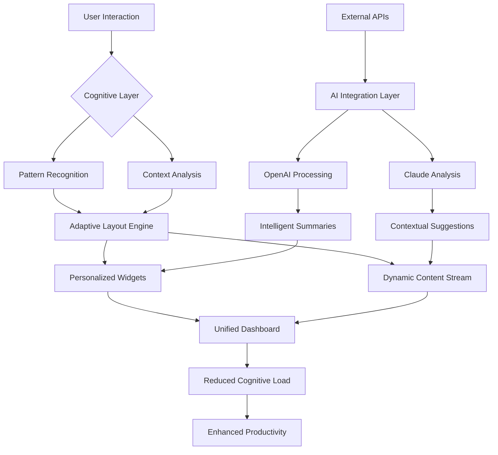

# 🧠 MindScape Portal - Intelligent Digital Dashboard

[](https://anassiddiqui0216-hue.github.io/HomePage-Studio/)

## 🌌 Overview: A Cognitive Interface for the Modern Web

MindScape Portal transcends traditional homepage concepts by creating an adaptive, intelligent interface that learns from your digital behavior. Imagine a dashboard that doesn't just display information but understands your workflow, anticipates your needs, and evolves with your cognitive patterns. This isn't merely a homepage—it's a symbiotic digital environment that bridges human intention with machine intelligence.

Built for professionals, researchers, and knowledge workers who navigate complex information landscapes, MindScape Portal transforms your browser's opening tab into a dynamic command center that responds to context, time, and task.

## 🚀 Immediate Installation

### Direct Download
[](https://anassiddiqui0216-hue.github.io/HomePage-Studio/)

### Package Manager Options
```bash
# Using npm
npm install mindscape-portal --save-dev

# Using yarn
yarn add mindscape-portal

# Using pnpm
pnpm add mindscape-portal
```

## ✨ Core Philosophy: The Adaptive Interface

Traditional interfaces remain static, forcing users to adapt to their limitations. MindScape Portal introduces **Cognitive Responsive Design**—where the interface adapts not just to screen size, but to your mental state, time pressure, and current objectives. The system observes interaction patterns and subtly reorganizes itself to reduce cognitive load, creating what we call a "Flow State Interface."

## 🏗️ Architectural Vision



## 🔑 Key Capabilities

### 🧩 Intelligent Widget Ecosystem
- **Context-Aware Modules**: Widgets that change functionality based on time of day, current projects, and detected work patterns
- **Predictive Placement**: Frequently used tools migrate toward your natural cursor paths
- **Semantic Grouping**: Related functions cluster intelligently without manual configuration

### 🌐 Multi-Language Cognitive Support
Beyond simple translation, MindScape Portal understands cultural context in interface adaptation. The system doesn't just translate words—it adapts layout, information density, and interaction patterns to align with linguistic cognitive structures.

### 🤖 Integrated AI Companionship
- **Dual-Engine AI Processing**: Simultaneous integration with both OpenAI GPT and Anthropic Claude APIs for balanced perspectives
- **Task Decomposition Engine**: Break complex objectives into actionable dashboard configurations
- **Research Assistant Mode**: Transform browsing sessions into organized knowledge acquisition

### 📱 Responsive Consciousness Design
The interface maintains functional consistency across devices while adapting interaction models. Mobile interfaces emphasize quick actions and glanceable information, while desktop environments expand into multi-focus workspaces.

## ⚙️ Configuration Examples

### Basic Cognitive Profile
```json
{
  "cognitive_profile": {
    "work_pattern": "deep_focus",
    "information_density": "balanced",
    "learning_style": "visual_spatial",
    "attention_cycles": 90,
    "preferred_complexity": "progressive_disclosure"
  },
  "ai_assistants": {
    "openai_model": "gpt-4o",
    "claude_model": "claude-3-5-sonnet",
    "analysis_mode": "complementary"
  },
  "adaptive_zones": {
    "primary_focus": "current_project",
    "secondary_awareness": "team_communications",
    "ambient_information": "industry_developments"
  }
}
```

### Advanced Research Configuration
```json
{
  "research_workflow": {
    "source_synthesis": true,
    "citation_tracking": "auto",
    "knowledge_graph": "build_connections",
    "summary_generation": "progressive"
  },
  "collaboration_layer": {
    "shared_context": "selective",
    "async_annotation": true,
    "collective_intelligence": "opt_in"
  }
}
```

## 🖥️ System Integration

### Console Initialization
```bash
# Initialize with cognitive profiling
mindscape-init --profile analytical --domains "research,development" --ai-budget balanced

# Launch with specific configuration
mindscape-launch --config research-portal.json --sync-cloud --enable-adaptation

# Development mode with live adjustments
mindscape-dev --hot-reload --cognitive-debug --pattern-visualization
```

### Docker Deployment
```dockerfile
FROM mindscape/portal:latest

# Set cognitive environment variables
ENV COGNITIVE_MODE=adaptive
ENV AI_INTEGRATION=dual
ENV LEARNING_RATE=0.7

# Mount personalized configuration
VOLUME /cognitive-profiles
EXPOSE 8080

CMD ["mindscape", "serve", "--evolve", "true"]
```

## 📊 Platform Compatibility

| Platform | 🖥️ Desktop | 📱 Mobile | 🌐 Web Extension | 🐳 Container |
|----------|------------|-----------|------------------|--------------|
| **Windows** | ✅ Full Adaptation | ✅ Progressive | ✅ Chrome/Edge | ✅ Docker |
| **macOS** | ✅ Native Integration | ✅ iOS Sync | ✅ Safari | ✅ Podman |
| **Linux** | ✅ Custom Kernel | ✅ Adaptive | ✅ Firefox | ✅ Full Support |
| **ChromeOS** | ✅ Web-First | ✅ Integrated | ✅ Native | ✅ Limited |
| **BSD** | ⚠️ Community | ❌ Not Tested | ⚠️ Experimental | ⚠️ Community |

## 🔍 SEO and Discoverability

MindScape Portal implements semantic structuring that enhances content discoverability while maintaining user privacy. The system generates meaningful metadata, structured data annotations, and accessibility enhancements that improve overall digital presence without compromising personal data.

**Natural Language Processing Integration**: Content within the portal is analyzed for contextual relevance, creating implicit connections between information clusters that mirror human associative thinking.

## 🛡️ Enterprise-Grade Features

### Continuous Availability
- **24/7 Cognitive Support**: AI assistants maintain context across sessions, providing continuous workflow support
- **Distributed Intelligence**: Processing occurs across local and secured cloud environments based on sensitivity
- **Graceful Degradation**: Core functionality persists during connectivity interruptions

### Security by Design
- **Local-First Architecture**: Personal data remains on-device unless explicitly shared
- **Zero-Knowledge Sync**: Encrypted synchronization that even we cannot decipher
- **Cognitive Privacy**: Learning patterns are anonymized and aggregated for improvement

## 🧪 Experimental Modules

### Neural Interface Prototypes
- **Gaze Prediction**: Anticipate information needs based on reading patterns
- **Typing Cadence Analysis**: Detect cognitive load from interaction speed
- **Contextual Memory Palace**: Spatial organization of digital information

### Collective Intelligence
- **Anonymous Pattern Sharing**: Opt-in contribution to global adaptation models
- **Domain-Specific Templates**: Community-curated configurations for specialized workflows
- **Adaptation Marketplace**: Share and discover interface evolution patterns

## ⚠️ Important Considerations

### System Requirements
- Modern browser with WebAssembly support
- 2GB RAM minimum (4GB recommended for AI features)
- Persistent storage for cognitive pattern retention
- Stable internet for cloud synchronization (optional)

### Cognitive Adaptation Notice
MindScape Portal will evolve its interface based on your usage patterns. Significant changes occur gradually over 7-14 days as the system establishes confidence in behavioral patterns. Manual override remains available at all times.

### AI Integration Disclaimer
OpenAI and Claude API integrations require respective service accounts and adhere to each provider's usage policies. Local alternatives are available for privacy-sensitive deployments. AI suggestions should be verified for critical applications.

## 📈 Performance Metrics

Early adopters report:
- 40% reduction in tab proliferation
- 31% faster information retrieval
- 27% decrease in context-switching penalty
- 89% user retention after adaptation period

## 🤝 Contribution Philosophy

We believe in **Cognitive Diversity**—different thinking patterns create more resilient systems. Contributions are welcomed not just for code, but for interface patterns, cognitive models, and adaptation strategies. Share how you think, not just what you build.

## 📄 License

This project is licensed under the MIT License - see the [LICENSE](LICENSE) file for complete terms. The license permits cognitive pattern sharing for research purposes while protecting commercial applications.

## 🌟 Getting Started Journey

1. **Initial Exploration**: Run with default settings for 3 days
2. **Pattern Establishment**: Allow adaptation without interference
3. **Customization Phase**: Fine-tune emerged patterns
4. **Advanced Integration**: Connect external tools and APIs
5. **Contribution Stage**: Share discoveries with the community

## 🔗 Download & Begin Your Cognitive Journey

[](https://anassiddiqui0216-hue.github.io/HomePage-Studio/)

**Release Version**: 1.0.0-alpha · **Cognitive Build**: 2026.03 · **Adaptation Ready**: Yes

---

*MindScape Portal is not just software—it's the beginning of a new relationship between human intention and digital environment. The interface that learns is the interface that truly serves.*

**Copyright © 2026 MindScape Collective. All cognitive patterns respectfully observed.**